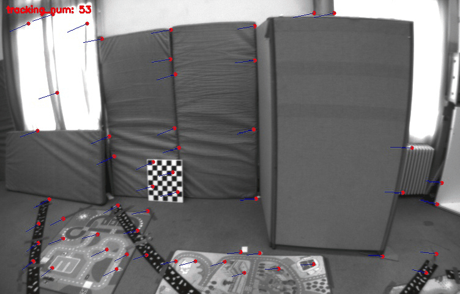

# py_vins

## Introduction
This project is a toy to show how different deep-learning feature matching methods affect the performance of visual-inertial odometry.


## ---
### 1. LK optical flow
[](doc/output_lk.gif)

[](doc/output_loftr.gif)

### 2. [SuperPoint]() + [SuperGlue]()


## Quick Start

### 1. Clone the repository
```bash
git clone https://github.com/LiXin97/py_vins.git
cd py_vins
```

### 2. Create a conda environment and install required packages
```bash
conda create -n py_vins python=3.8
conda activate py_vins
pip install -r requirements.txt
```

### 3. Download the [EuRoC dataset](https://projects.asl.ethz.ch/datasets/doku.php?id=kmavvisualinertialdatasets) and unzip it
```bash
mkdir data && cd data
wget http://robotics.ethz.ch/~asl-datasets/ijrr_euroc_mav_dataset/vicon_room1/V1_01_easy/V1_01_easy.zip
unzip V1_01_easy.zip
```

### 4. Run the code
```bash
python 
```

## Results

### 1. EuRoC dataset

| Method | V1_01_easy | V1_02_medium | V1_03_difficult | V2_01_easy | V2_02_medium | V2_03_difficult | V3_01_easy | V3_02_medium | V3_03_difficult |
| :----: | :--------: | :----------: | :-------------: | :--------: | :----------: | :-------------: | :--------: | :----------: | :-------------: |
|-|  - |  - |  - |  - |  - |  - |  - |  - |  - |

## References

